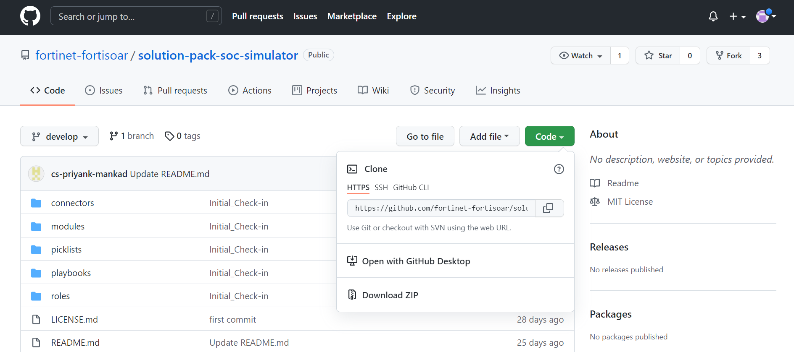
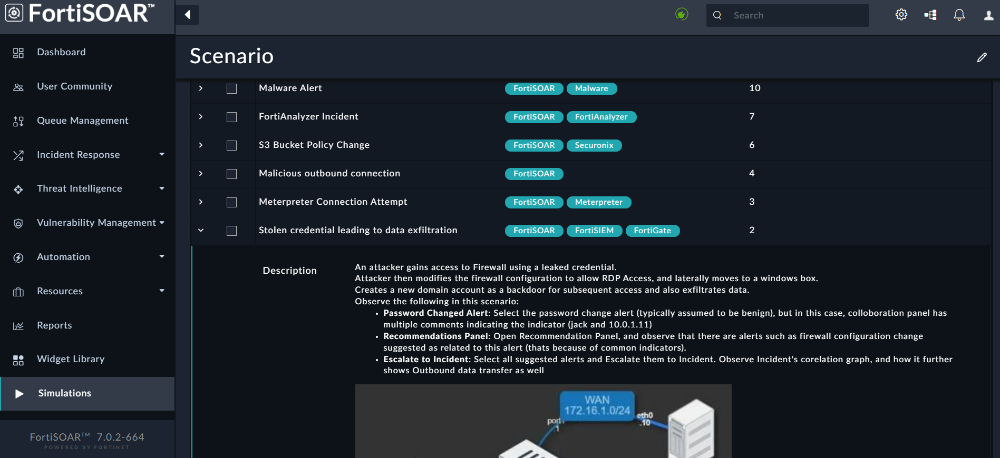
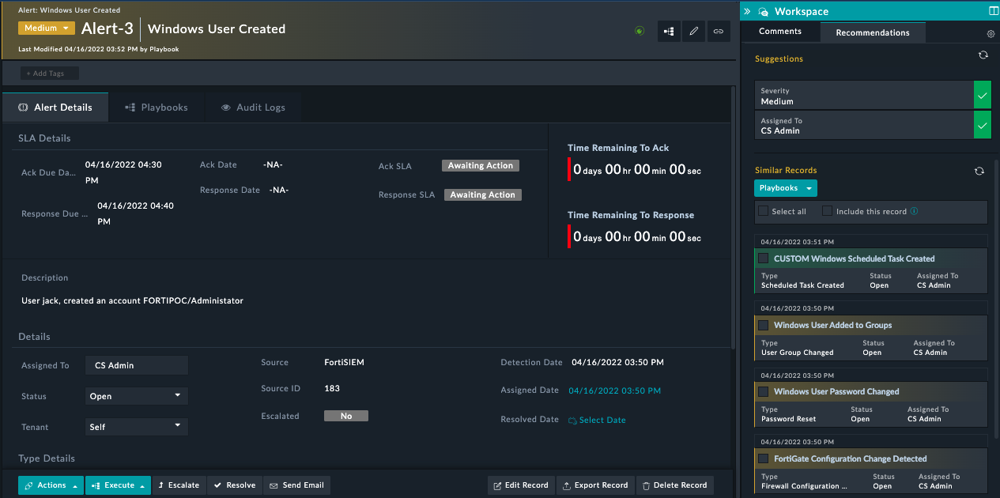
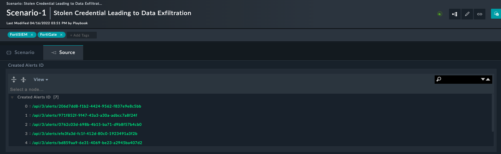

# SOC Simulator Solution Pack 7.0.2

## Overview

This article describes the FortiSOAR™ SOC Simulator Solution Pack (solution-pack-soc-simulator). This solution pack enables users to experience the power and capability of FortiSOAR™ incident response for SOC Simulator scenarios. 

FortiSOAR™ is built using modular architecture and the FortiSOAR™ Incident Response Solution Pack is the implementation of the best practices to configure and use FortiSOAR™ in an optimal manner. The FortiSOAR™ Incident Response Solution Pack also contains a lot of sample/simulation/training data that enables you to experience FortiSOAR™ without having all the devices.

## Deploying SOC Simulator Solution Pack

**Important**: Before you deploy the solution pack, ensure that you have deployed the FortiSOAR™ Incident Response Solution Pack ([solution-pack-incident-response](https://github.com/fortinet-fortisoar/solution-pack-incident-response)).

Use the following procedure as a *root* user to deploy the solution pack:

1. Log onto the Solution Pack GIT repo [https://github.com/fortinet-fortisoar/solution-pack-soc-simulator](https://github.com/fortinet-fortisoar/solution-pack-soc-simulator) using your credentials.
2. Click the **Code** button and select the **Download ZIP** option.  
   
3. Log into your FortiSOAR instance, and on the left-navigation, click **Import Wizard**.  
   
4. On the `Import Wizard` page, click **Import From File** and selected the solution pack zip that you have downloaded, and navigate through the Import Wizard.  
     
   **Note**: It is recommended not the change any configurations or options of the imported solution pack zip file.  
   Once the import is successfully completed, you must configure the FortiSOAR SOC Simulator connector and then you can use the SOC Simulator Solution Pack.

## Configuring the FortiSOAR SOC Simulator Connector

The FortiSOAR SOC Simulator connector is used to create various scenarios. To configure this connector, open the FortiSOAR SOC Simulator Connector and in its "Configuration Page" enter the following values for the configuration parameters: 

- **Configuration Name**: Provide a name for this configuration and you can optionally mark this configuration as the “Default Configuration”. 
- **Import Scenarios**: Select this checkbox to import various scenarios. 
- **Load Threat Intelligence**: Whenever records are recreated for a scenario, they include known malicious indicators, such as IP addresses, file hash, etc. Selecting this checkbox randomly assigns the malicious indicators to records every time a record is created. Therefore, the records get created with new indicators each time.

Once you have configured the FortiSOAR SOC Simulator connector, sample scenarios get created in **Help** > **Scenario** and now, you are all set to start using the solution pack and creating demo records. 

## Scenarios

Users can use various scenarios to understand how FortiSOAR™ handles various scenarios. To view scenarios, click **Help** > **Scenario**. The Scenario page displays various scenarios, such as Data Leakage, Phishing Emails, etc. 

Some scenarios demonstrate particular features of FortiSOAR™, such as FortiSOAR™ recommendation engine which lists alerts containing similar hosts etc, providing you with a complete picture of the incident. Some scenarios demonstrate an investigation process and therefore contain associated investigation playbooks, etc.  

For example, in the Stolen Credentials scenario, click the down-arrow on the “Stolen credential leading to data exfiltration” row, and the description of this scenario is displayed: 

To run this scenario, select Stolen credential leading to data exfiltration and click **Run Scenario**. Clicking Run Scenario creates alerts and/or incidents corresponding to this scenario. Clicking an alert created by this scenario, for example, the “Windows User Created”, opens the alert and when you click on the Recommendations tab, you observe that many similar alerts have been created, giving you an idea that related operations are taking place, and therefore, the task of a SOC analyst to go through a number of alerts to figure out what is similar is solved by FortiSOAR™ Recommendation engine. Now, you can select all the similar alerts and link them and also escalate them to create a Security Incident. 

To view the source for the Stolen credential leading to data exfiltration scenario, click **Help** > **Scenario** > **Stolen credential leading to data exfiltration**. Then click on the **Source** tab, the “Steps” section, contains data used by playbooks to create the demo records. Once the alerts are created their IDs are listed in the “Created Alerts” section:

If you want to delete the records created by this scenario, you can click the **Reset Scenario** button on the “Scenario” page.  

You can also click the **Run Selected** **Scenario** to create a specific scenario from the “Alerts” page. 