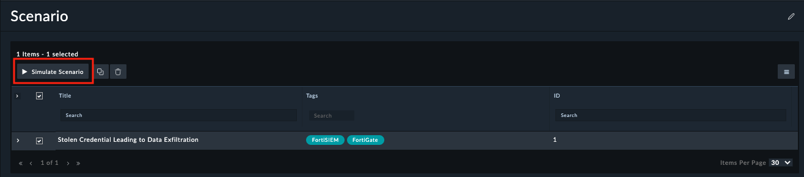
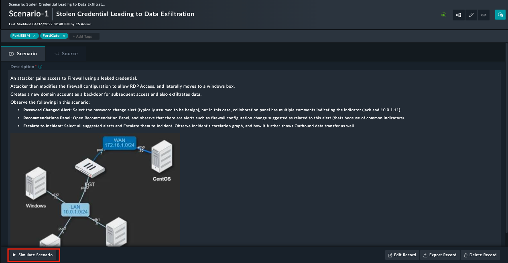
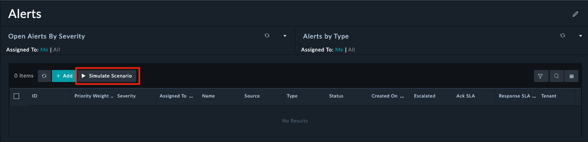
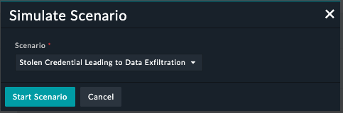
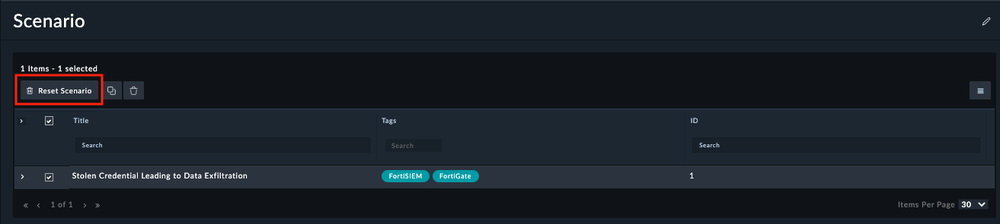
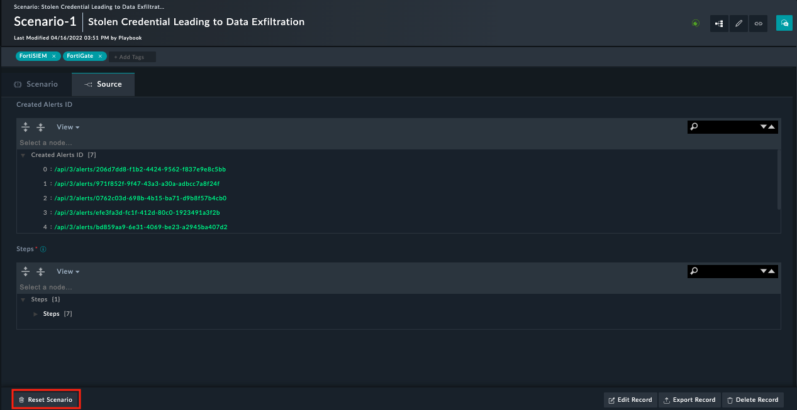

# Usage of SOC Simulator Solution Pack

## Configuring the FortiSOAR SOC Simulator Connector

This solution pack installs and configures the FortiSOAR SOC Simulator Connector with a default "demo" configuration.

## Scenario

 FortiSOAR™ can handle various scenarios as follows.
Click **Simulations** to view the **Scenario** page. You can import these scenarios through various Solution Packs such as Phishing Email Response or Brute Force Attack Response.

Some scenarios demonstrate various features of FortiSOAR™, such as the FortiSOAR™ recommendation engine that lists alerts related to similar hosts. This recommendation gives you a complete picture of the incident.
Other scenarios demonstrate the investigation process and therefore contain associated investigation playbooks.

For example, in the scenario Stolen Credentials (available with Stolen Credential Leading to Data Exfiltration Solution Pack), click the right arrow on the "Stolen credential leading to data exfiltration" row to expand the scenario and view the description.

## Simulate Scenario

There are various ways a user can run a scenario simulation:

- **From Scenario Page:**
  - Click on **Simulations** to open Scenario page, select **Stolen credential leading to data exfiltration** and click **Simulate Scenario**.

    

- **From Scenario Record:**
  - Click on **Simulations**, open **Stolen credential leading to data exfiltration** scenario record and click **Simulate Scenario**.

    

- **From Alert Page:**
  - Click on **Incident Response**, choose **Alerts** to open the Alerts page, and click **Simulate Scenario** that gives a popup

    

  - Select **Stolen credential leading to data exfiltration** from **Scenario** and click **Start Simulation** to run a scenario.

    

This action creates alerts and records corresponding to the selected scenario.
Click an alert created by this simulation, for example, "Windows User Created" alert. The alert opens.
Point to the comments icon on the far right corner and select it.
Click on the Recommendations tab to observe that there are other similar alerts indicating that related operations are taking place.
Hence, the FortiSOAR™ engine solves the task of a SOC analyst of going through several alerts to figure out what is similar. Now, you can select similar alerts, link them, or escalate them to create a Security Incident.

To view the source for the **Stolen credential leading to data exfiltration** scenario, click **Simulations** > **Scenario** > **Stolen credential leading to data exfiltration**. Go to the **Source** tab, where the **Steps** section contains data used by playbooks to create the demo records. IDs of the alerts created here appear in the "Created Alerts" section:

## Reset Scenario

To delete the records created by this simulation, the user needs to follow one of the following methods:

- Click on **Simulations** to open **Scenario** page. Select a scenario 'Stolen credential leading to data exfiltration' on the "Scenario" page and click the **Reset Scenario** button.

    

- Click on **Simulations** to open **Scenario** page. Open a scenario record 'Stolen credential leading to data exfiltration' and click the **Reset Scenario** button.

    
