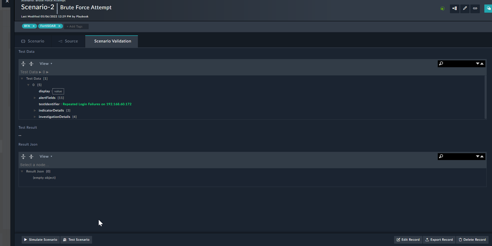
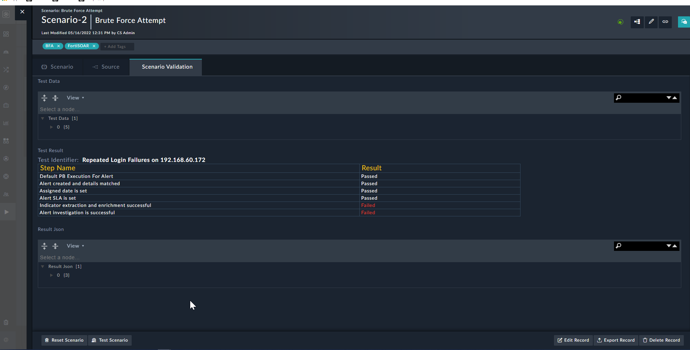

# Automate end to end testing of scenario simulations

## Background

Often after simulating a scenario we need to test whether the simulation and post simulation activities have correctly happened. The soc simulator has some playbooks that can automated the tests and present the result in a user understandable HTML format.

## Prerequisites

- **Connectors:**
  - Code snippet and soc simulator connectors must be installed and configured.
- **Test Data:**
  - The test automation playbook need some test data which must be present in the "Test Data" field of a scenario under the Scenario Validation tab. You may find the test data prepopulated post installing a scenario depending on if the scenario is validated with the Solution Pack Test Automation Playbooks.

## Test Scenario

Each scenario will be having a "Test Scenario" button at the bottom of the scenario details page as shown below.
.

To test the scenario you need to click on the "Test Scenario" button. This will first automatically simulate the scneario and then perform some automated checks on the simulation. The result will be displayed in two formats. The "Test Result" will contain result in HTML format and result json will have the json equivalent of the same result.

For example this is the test result after testing the end to end flow of Brute Force Attack  Scenario.
.
