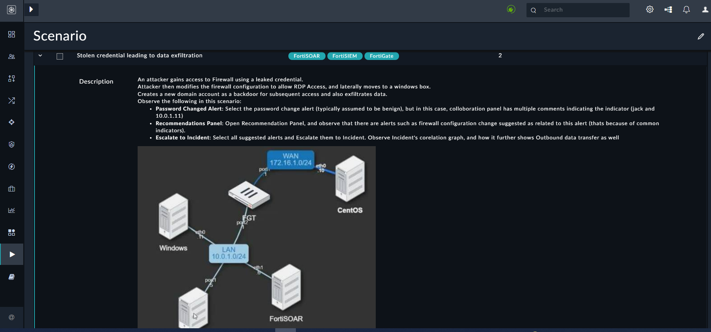

| [Home](/README.md) | 
|--------------------------------------------|

# Usage

FortiSOAR&trade; can handle various scenarios that demonstrate its various features, such as the FortiSOAR&trade; recommendation engine that lists alerts related to similar hosts. This recommendation gives you a complete picture of the incident.

There are other scenarios that demonstrate the investigation process and therefore contain associated investigation playbooks.

For example, in the *Stolen Credentials* scenario &ndash; available with **Stolen Credential Leading to Data Exfiltration** solution pack &ndash; to expand the scenario and view the description, click the right-pointing arrow on the **Stolen credential leading to data exfiltration** row.

## Simulate a Scenario

Simulating a scenario creates example alerts and records corresponding to the selected scenario. For example, when you run *Stolen Credentials* scenario, it creates multiple demo alerts of different alert types.

Click an alert created by this simulation, for example, *Windows User Created* to open this alert and observe the following:

- Select the Comments icon on the far right corner to open it.
- Click on the **Recommendations** tab to observe that there are similar other alerts indicating that related operations are taking place.

Hence, the FortiSOAR™ engine eases a SOC analyst's task of going through several alerts to find out the similar ones. Now, they can select similar alerts, link them, or escalate them to create a security incident.

To view the source for the **Stolen credential leading to data exfiltration** scenario,
1. Click **Simulations** > **Scenario** > **Stolen credential leading to data exfiltration**.
2. Go to the **Source** tab to view the **Steps** section that contains data used by playbooks to create the demo records. IDs of the alerts created here appear in the **Created Alerts** section:

## Launch a Scenario Simulation

The **SOC Simulator** solution pack places the option to run simulations at multiple places for increased convenience. Following are the multiple ways in which you can run simulations.

### From Scenario Page

1. Click **Simulations** to open Scenario page listing all the available scenarios.
2. Click the checkbox to select a scenario.
3. Click the button **Simulate Scenario**.

    

### From Scenario Record

1. Click **Simulations** to open **Scenario** page.
2. Click a scenario record to open it.
3. Click the button **Simulate Scenario**.

    

### From Alerts Page

1. Click **Incident Response** > **Alerts** to open the Alerts page.
    
2. Click the button **Simulate Scenario**.
3. From the **Simulate Scenario** select a scenario from the **Scenario** drop-down.
4. Click **Start Simulation** to run the selected scenario.

    

## Reset a Scenario

Resetting a scenario removes any demo alerts created by that scenario. **Reset Scenario** option helps clear the environment of any example alerts and helps display only the actuals.

You can reset a scenario by using any of the following methods.

### From Scenario Page

1. Click on **Simulations** to open the **Scenario** page.
2. Click the checkbox to select a scenario that you have already run.
3. Click the button **Reset Scenario**.

    

### From Scenario Record

1. Click **Simulations** to open **Scenario** page.
2. Click a scenario record, which you have already run, to open it.
3. Click the button **Reset Scenario**.

    
