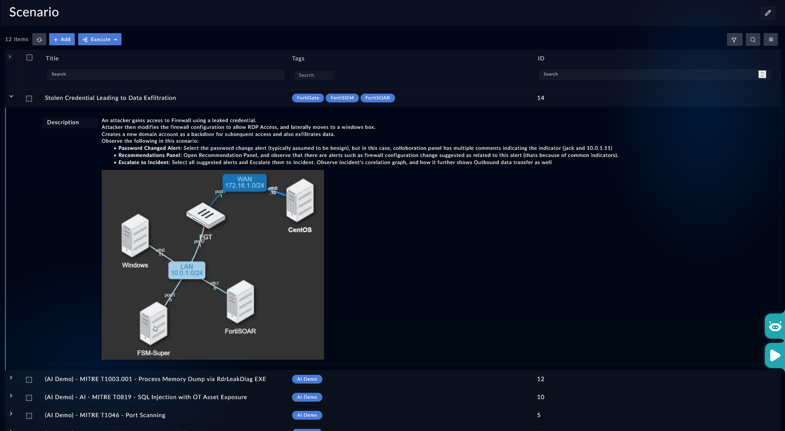
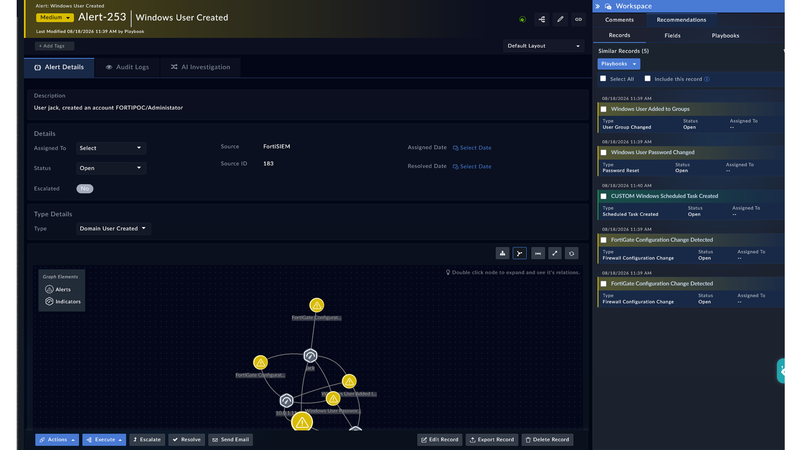
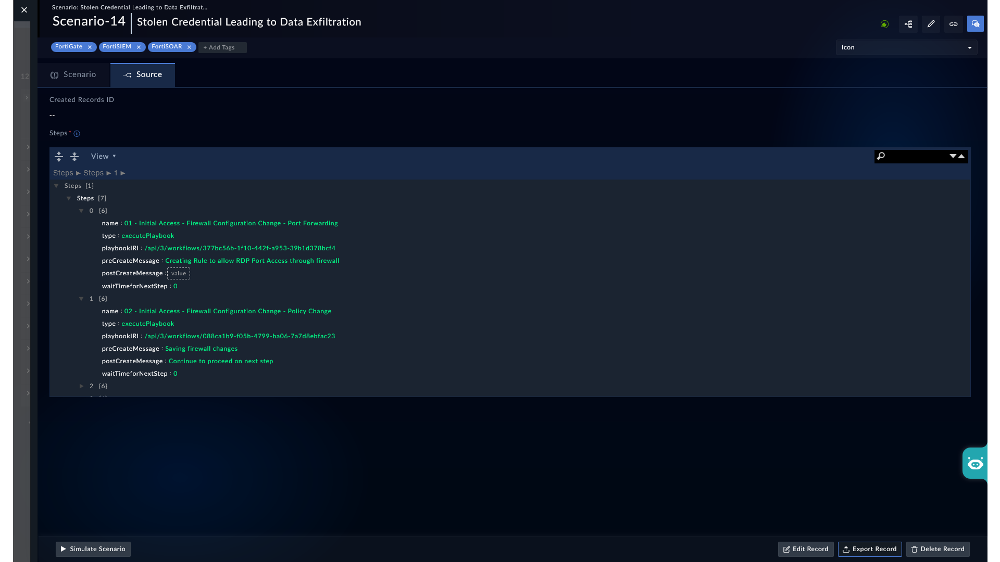
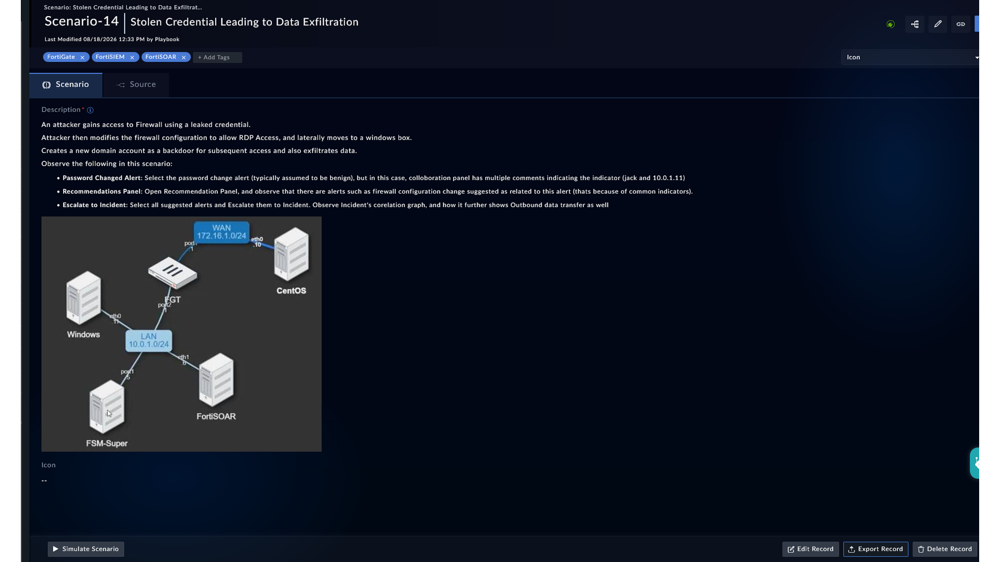
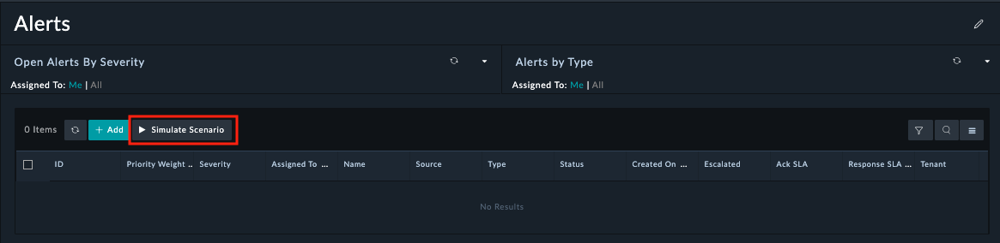
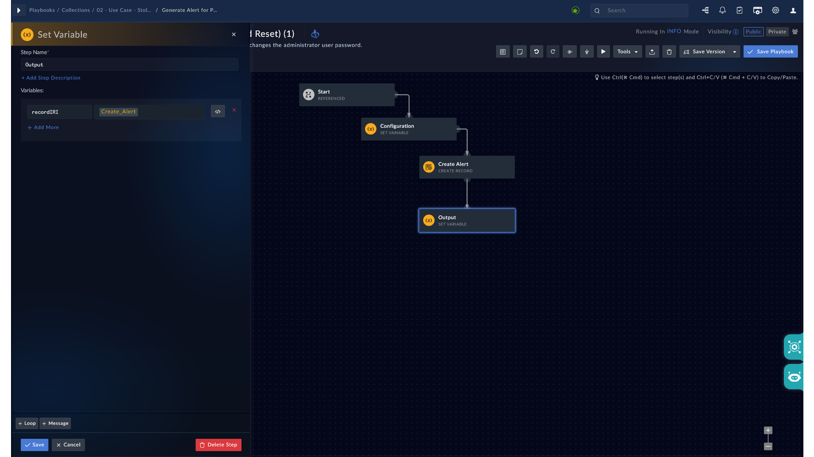

| [Home](../README.md) |
| -------------------- |

# Usage

FortiSOAR can handle various scenarios that demonstrate its various features, such as the FortiSOAR recommendation engine that lists alerts related to similar hosts. This recommendation gives you a complete picture of the incident.

There are other scenarios that demonstrate the investigation process and therefore contain associated investigation playbooks.

For example, in the *Stolen Credentials* scenario (available with the **Stolen Credential Leading to Data Exfiltration** solution pack), to expand the scenario and view the description, click the right-pointing arrow on the **Stolen credential leading to data exfiltration** row.

You can also click the green  icon to run the scenario and create demo alerts.

## Scenario icons

Each scenario record includes an *Icon* field that holds a representative image for the scenario. The icon appears on the scenario record and on the scenario card in the Scenario Simulator widget, which makes scenarios easier to identify at a glance.

The field is optional. Scenarios without an icon display a default placeholder image in the widget. To set or change an icon, open the scenario record and update the **Icon** field.

## Simulate a scenario

Simulating a scenario creates demo alerts and records corresponding to the selected scenario. For example, when you run the *Stolen Credentials* scenario, it creates multiple demo alerts of different alert types.

Click an alert created by this simulation, for example, *Windows User Created* to open this alert and observe the following:

- Select the Comments icon on the far right corner to open it.

- Click the **Recommendations** tab to observe that there are similar other alerts indicating that related operations are taking place.

Hence, the FortiSOAR engine eases a SOC analyst's task of going through several alerts to find the similar ones. Now, they can select similar alerts, link them, or escalate them to create a security incident.

To view the source for the **Stolen credential leading to data exfiltration** scenario:

1. Click <picture><source media="(prefers-color-scheme: dark)" srcset="./res/icon-resources-light.svg"></picture> **Resources** <picture><source media="(prefers-color-scheme: dark)" srcset="./res/icon-chevron-light.svg"></picture> <picture><source media="(prefers-color-scheme: dark)" srcset="./res/icon-play-light.svg"></picture> **Simulations** to open the *Scenario* page listing all the available scenarios.

2. Click **Stolen credential leading to data exfiltration**.

>[!Note]
>You may need to install the **Stolen Credential Leading to Data Exfiltration** solution pack to view this scenario.

3. Go to the **Source** tab to view the **Steps** section that contains data used by playbooks to create the demo records. IDs of the alerts created here appear in the **Created Alerts** section:

## Launch a scenario simulation

The **SOC Simulator** solution pack places the option to run simulations at multiple places for increased convenience. Following are the multiple ways in which you can run simulations.

### Using the Scenario page

1. Click <picture><source media="(prefers-color-scheme: dark)" srcset="./res/icon-resources-light.svg"></picture> **Resources** <picture><source media="(prefers-color-scheme: dark)" srcset="./res/icon-chevron-light.svg"></picture> <picture><source media="(prefers-color-scheme: dark)" srcset="./res/icon-play-light.svg"></picture> **Simulations** to open the *Scenario* page listing all the available scenarios.

2. Click the checkbox to select a scenario.

3. Click the **Simulate Scenario** button.

### Using a Scenario record

1. Click <picture><source media="(prefers-color-scheme: dark)" srcset="./res/icon-resources-light.svg"></picture> **Resources** <picture><source media="(prefers-color-scheme: dark)" srcset="./res/icon-chevron-light.svg"></picture> <picture><source media="(prefers-color-scheme: dark)" srcset="./res/icon-play-light.svg"></picture> **Simulations** to open the *Scenario* page listing all the available scenarios.

2. Click a scenario record to open it.

3. Click the **Simulate Scenario** button.

    

### Using the Alerts page

1. Click <picture><source media="(prefers-color-scheme: dark)" srcset="./res/icon-security-operations-light.svg"></picture> **Security Operations** <picture><source media="(prefers-color-scheme: dark)" srcset="./res/icon-chevron-light.svg"></picture> <picture><source media="(prefers-color-scheme: dark)" srcset="./res/icon-alert-light.svg"></picture> **Alerts** to open the Alerts page.

2. Click the **Simulate Scenario** button.

    

3. From the **Simulate Scenario** dialog, select a scenario from the **Scenario** drop-down.

4. Click **Start Simulation** to run the selected scenario.

### Using the Scenario Simulator widget

The Scenario Simulator widget provides a card-based view of available scenarios and lets you run or reset simulations without leaving the current page. The widget opens as a half-width drawer on record list pages, such as the Alerts page.

The widget displays the following for each scenario:

- The scenario icon, title, and tags.

- The scenario description, rendered from Markdown. Click **View More** to expand long descriptions.

- A **Run Scenario** button for scenarios that have not been run, or a **Reset Scenario** button for scenarios that have already created demo records.

>[!Note]
>Refer to [Customize Scenario Simulator](./customize-scenario-simulator.md) for customizing the simulation records as they appear in the widget.

To run a simulation from the widget:

1. Open the widget on a record list page.

2. Optionally, use the search box to filter scenarios by title, description, or tag.

3. Click **Run Scenario** on the scenario card. The button displays *Simulating* while the scenario playbook executes.

To reset a scenario from the widget, click **Reset Scenario** on the card of a scenario that has already been run. The button displays *Resetting* while the demo records are removed.

The widget refreshes automatically when scenario records are created, updated, or deleted, so the list and button states stay current. Use the refresh button next to the item count to reload the list manually.

## Reset a scenario

Resetting a scenario removes any demo alerts created by that scenario. The **Reset Scenario** option helps clear the environment of any demo alerts and helps display only the actual records.

You can reset a scenario by using any of the following methods.

### Using the Scenario page

1. Click <picture><source media="(prefers-color-scheme: dark)" srcset="./res/icon-resources-light.svg"></picture> **Resources** <picture><source media="(prefers-color-scheme: dark)" srcset="./res/icon-chevron-light.svg"></picture> <picture><source media="(prefers-color-scheme: dark)" srcset="./res/icon-play-light.svg"></picture> **Simulations** to open the **Scenario** page.

2. Click the checkbox to select a scenario that you have already run.

3. Click the **Reset Scenario** button.

### Using scenario records

1. Click <picture><source media="(prefers-color-scheme: dark)" srcset="./res/icon-resources-light.svg"></picture> **Resources** <picture><source media="(prefers-color-scheme: dark)" srcset="./res/icon-chevron-light.svg"></picture> <picture><source media="(prefers-color-scheme: dark)" srcset="./res/icon-play-light.svg"></picture> **Simulations** to open the **Scenario** page.

2. Click a scenario record, which you have already run, to open it.

3. Click the **Reset Scenario** button.

## Export and import scenarios

You can move scenarios between FortiSOAR environments by exporting them to a JSON file and importing that file on the target system. This is useful for sharing custom scenarios across development, staging, and demo environments.

### Export scenarios

Exporting creates a JSON file containing the selected scenarios and stores it as an attachment record.

1. Click <picture><source media="(prefers-color-scheme: dark)" srcset="./res/icon-resources-light.svg"></picture> **Resources** <picture><source media="(prefers-color-scheme: dark)" srcset="./res/icon-chevron-light.svg"></picture> <picture><source media="(prefers-color-scheme: dark)" srcset="./res/icon-play-light.svg"></picture> **Simulations** to open the **Scenario** page.

2. Click the checkboxes to select one or more scenarios.

3. Run the **Export Selected Scenario** action.

4. Retrieve the exported JSON file from the **Attachments** module.

### Import scenarios

Importing recreates scenario records, including their relationships, from a previously exported JSON file.

1. Run the **Import Scenario** action and provide a valid exported JSON file.

2. Once the playbook completes, the imported scenarios appear on the **Scenario** page.

## Guidelines to create a scenario playbook

These guidelines address the scenario playbook creation process.

1. **Scenario playbook naming convention:**

   - The naming format for scenario playbooks should follow this structure: `Scenario - <playbook_name>`. Replace `<playbook_name>` with an appropriate name that reflects the purpose of the playbook.

2. **Scenario tag assignment:**

   - Each scenario playbook should be tagged with the label `Scenario`. This tag helps organize and identify playbooks specifically designed for scenarios.

3. ***Set Variable* step for recordIRIs:**

   - Conclude each scenario playbook with a *Set Variable* step. In this step, create a variable named `recordIRIs` and assign it a value representing the list of all demo records generated by the scenario playbook.

>[!Important]
>Going forward we'll be using the *`recordIRIs`*, instead of `@id`, output variable for future releases.
>
>

## Next Steps

| [Installation](./setup.md#installation) | [Configuration](./setup.md#configuration) | [Contents](./contents.md) |
|-----------------------------------------|-------------------------------------------|---------------------------|